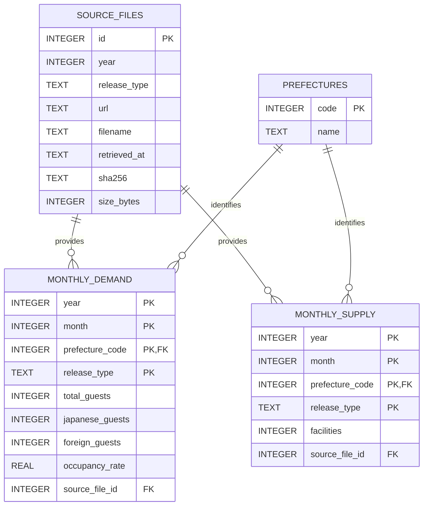

# Hotel Supply & Demand ETL

> [!IMPORTANT]
> Google Colab上の旧分析を、ホテル不動産の担保評価・与信管理を支援する宿泊市場マクロモニタリング基盤へ再構築しました。公式ExcelからSQLiteを再生成するPhase 1と、分析・ウォッチ判定・静的レポートを生成するPhase 2を実装済みです。

> [!WARNING]
> `docs/memo/change_request.md`に記載した修正事項と、それを反映した分析・parser・レポートコードはレビュー前です。指標定義、方向判定、相対評価、生成結果は暫定版であり、独立したコードレビューと分析妥当性レビューが完了するまで確定仕様として扱いません。

## v2 再構築方針

観光庁「宿泊旅行統計調査」はe-Statと観光庁から公式Excelが配布され、一部の旧系列はe-Stat APIからも取得できます。継続利用には、年度別の提供形式、速報値と確定値、訂正・差し替え、欠損、データ品質を管理する必要があります。

API提供範囲を実測した結果、2019・2024・2025年の年確定値は統計値APIの対象として確認できませんでした。そのため、2019～2025年MVPは公式Excelを入力とし、属人的なNotebook処理を、公式データの取得から検証、蓄積、分析用データ生成、レポート出力まで再実行できるデータパイプラインへ移行します。

### 利用目的

担保評価・審査・与信管理の担当者が、ホテルを取り巻く都道府県単位の市場環境を把握し、評価前提や個別ホテルの実績について追加確認が必要な変化を検知することを目的とします。

本システムは担保価値、融資可否、LTV、個別ホテルの収益性を自動算定するものではありません。成果物は、地域のマクロ環境を整理する都道府県別マーケットシートと市場ウォッチリストを想定しています。

### 技術的な取り組み

v2では、次の機能を段階的に実装します。

- `sources.toml`に明示した公式URLからExcelを取得する処理
- URL、取得日時、SHA-256による来歴管理と、同一ファイルの再取得を避ける冪等性
- 2019～2025年の年確定値 `.xlsx` を共通スキーマへ正規化する処理
- e-Stat APIの提供範囲・統計表・分類コードを調査するAPIクライアント
- API提供状況が変わった場合の公式Excelとの標本照合
- アプリケーションIDを環境変数・CI Secretsで扱う認証情報管理
- 需要、供給、出典、公表版を分離したSQLiteデータモデル
- 速報値・確定値・訂正値を上書きせず保持する履歴管理
- 都道府県、年月、重複、欠損、数値範囲を確認するデータ品質検証
- stagingとトランザクションを用いた安全かつ冪等なDB更新
- fetch → normalize → validate → load → report を実行するCLI
- fixtureを用いたparserテスト、回帰テスト、統合テスト
- テストによる取得・変換・品質検証の自動確認
- SQL viewを介した分析用月次・年次データの提供
- 都道府県別マーケットシートと市場ウォッチリストの生成

この再構築を通じて、外部の非構造データを取得・正規化するだけでなく、出典、版、品質、再実行性、下流利用まで考慮した小規模データパイプラインの設計・実装を目指します。

### 自動化範囲の設計判断

年確定値は更新頻度が低く、MVPの対象ファイル数も限定されます。そのため、初期版では公式ページのHTML解析や定期巡回を行わず、レビュー可能な`sources.toml`に取得対象URLを明示します。`hotel-etl fetch`を手動実行すると、ファイル形式を検証し、SHA-256と取得履歴を記録し、同じ内容のファイルは再取得しない設計とします。

公式ページからのリンク自動発見、速報値の定期取得、GitHub Actionsによる巡回、自動PRは、継続運用の必要性が確認された場合のOptional機能とします。低頻度・少数ファイルのために複雑な収集基盤を先に作らず、ETL本体、品質検証、再現性を優先します。

実装方針、フェーズ、完了条件は [v2 修正方針・ロードマップ](docs/v2-roadmap.md) を参照してください。
e-Stat APIの実測結果は [e-Stat API 提供範囲調査](docs/estat-api-audit.md) に記録しています。

## 現在の状態

Phase 1では、2019～2025年の公式年確定値Excelについて、固定URLからの安全な取得、manifest・SHA-256による来歴管理、共通スキーマへの変換、品質検証、需要・供給SQLiteの再生成まで実装しています。Phase 2では、Recovery、Demand Mix、Momentum、Supply-Demandの4軸について、2019年同月終了LTM比、LTM YoY、直近3か月YoY、全国分布内の相対位置を計算します。Seasonal CVと上位3か月集中度は警戒判定ではなく市場特性として併記し、47都道府県のマーケットシートと市場ウォッチリストをCSV・HTMLで生成します。入力Excel、manifest、生成DBは再生成可能なためGit管理しません。

### 処理フローとモジュール構成

CLIがコマンドを受け付け、`pipeline.py`がユースケース全体を調整します。`pipeline.py`自身に取得・変換・保存の詳細を集約せず、各処理を責務別のモジュールへ委譲しています。

```text
sources.toml
     │
     ▼
  cli.py                         コマンドの受付
     │
     ▼
pipeline.py                      処理順序の制御（オーケストレーション）
     ├── sources.py              公式データ取得元の設定読込・検証
     ├── fetcher.py              Excel取得・形式検証・manifest／ハッシュ管理
     ├── parser.py               年次Excelから共通月次レコードへの変換
     ├── validation.py           件数・キー・値範囲・整合性の品質検証
     └── database.py             検証済みレコードからSQLiteを安全に再生成
             │
             ▼
 data/processed/hotel_market.sqlite3
             │
             ├── analysis.py    年次指標・市場状態・ウォッチ理由の算出
             └── report.py      CSV・全体HTML・47県マーケットシートの生成
```

| モジュール | 責務 |
|---|---|
| `cli.py` | CLIエントリーポイント。引数を解釈し、パイプラインまたはe-Stat調査機能を呼び出す |
| `pipeline.py` | 取得、ハッシュ照合、変換、検証、DB生成を所定の順序で接続する |
| `sources.py` | `sources.toml`を読み込み、対象年、URL、ファイル名を検証する |
| `fetcher.py` | 公式Excelを一時ファイルへ取得し、XLSX形式とSHA-256を検証してRaw領域へ保存する |
| `parser.py` | 年度別Excelの第1表・第4表・第8表を`MonthlyRecord`へ正規化する |
| `validation.py` | 47都道府県、12か月、重複、負数、稼働率などの品質ルールを適用する |
| `database.py` | 需要・供給・出典をSQLiteへ格納し、成功したDBを原子的に置き換える |
| `models.py` | モジュール間で受け渡す共通月次データモデルを定義する |
| `analysis.py` | DBからLTM・直近3か月指標と全国相対順位を計算し、方向の組み合わせから市場状態と検知理由を生成する |
| `report.py` | 47都道府県の分析CSV、ウォッチリスト、日本人・外国人需要構成を含む静的HTMLマーケットシートを生成する |
| `estat_client.py` | e-Stat APIの提供範囲とメタデータを調査する外部APIクライアント |

この分割により、取得元、Excel形式、品質ルール、保存先のいずれかが変わった場合でも、変更範囲を該当モジュールへ限定し、それぞれを独立してテストできます。品質検証が成功するまでDBを更新しないことも、処理順序として明示しています。

### SQLite ER図

出典、都道府県マスター、需要統計、供給統計を分離し、各統計行から取得元の公式Excelを追跡できる構成です。需要・供給テーブルの主キーは、対象年、対象月、都道府県、公表区分の複合キーです。



各列の定義、単位、欠測値の扱いは[データ辞書](docs/data-dictionary.md)に記載しています。分析用Viewは永続テーブルと分けています。

### Phase 1の実行方法

Python 3.11以上で仮想環境を作成し、`pyproject.toml`からインストールします。Excelパイプラインにe-StatのアプリケーションIDは不要です。

```bash
python -m venv .venv
.venv/bin/python -m pip install -e .
.venv/bin/hotel-etl pipeline
```

この1コマンドで公式Excel 7ファイルを取得し、`data/raw/manifest.json`へ来歴を記録して、`data/processed/hotel_market.sqlite3`と`reports/latest/`の分析レポートを生成します。同じURL・ハッシュの取得済みファイルはスキップします。ネットワークを使わず取得済みExcelからDBだけを作り直す場合は次を実行します。

```bash
.venv/bin/hotel-etl build-db
```

既存DBからレポートだけを再生成する場合：

```bash
.venv/bin/hotel-etl monitor --target-year 2025 --base-year 2019
```

主な成果物は次のとおりです。

- [`reports/latest/index.html`](reports/latest/index.html)：47都道府県の市場状態と検知理由
- `reports/latest/market-sheets/`：県別の指標、月次需要、観測事実、次の確認事項
- `reports/latest/prefecture-market.csv`：全47県の分析結果
- `reports/latest/watchlist.csv`：設定した条件に該当する市場

2025年12月終了LTMでは31県が方向ベースの追加調査トリガーに該当しました。この件数は信用リスクの高い県数ではなく、対象ホテル・商圏の追加確認を促す一次スクリーニング結果です。変化幅が小さくても正負の方向で検知するため、実数値と全国相対位置を併読します。指標、シグナル、分類順序、利用上の制約は[分析方法論](docs/methodology.md)、分析期間は[`analysis.toml`](analysis.toml)に明示しています。

特定年だけを検証する場合は、たとえば `--years 2019 2024 2025` を付けます。全テストは次で実行できます。

```bash
.venv/bin/python -m unittest discover -s tests -v
```

DBの列定義と欠測値の扱いは[データ辞書](docs/data-dictionary.md)を参照してください。

### e-Stat API探索の実行方法

画像やチャットへ公開していない新しいe-StatアプリケーションIDを環境変数へ設定します。

```bash
read -s ESTAT_APP_ID
export ESTAT_APP_ID
echo
```

Codexなど別の実行セッションから利用する場合は、Git除外済みの`.env`へ保存できます。

```bash
read -s ESTAT_APP_ID
printf 'ESTAT_APP_ID=%s\n' "$ESTAT_APP_ID" > .env
unset ESTAT_APP_ID
echo
```

開発版をインストールせずに統計表を検索する場合：

```bash
PYTHONPATH=src python -m hotel_supply_demand.cli search-tables \
  --query '宿泊旅行統計調査' \
  --limit 20
```

統計表IDを特定した後は、メタ情報と少量のサンプルを取得できます。

```bash
PYTHONPATH=src python -m hotel_supply_demand.cli show-metadata \
  --stats-data-id '<統計表ID>'

PYTHONPATH=src python -m hotel_supply_demand.cli fetch-sample \
  --stats-data-id '<統計表ID>' \
  --limit 10
```

認証情報を必要としない初期テスト：

```bash
PYTHONPATH=src python -m unittest discover -s tests -v
```

現行版には次の既知の課題があります。

- Google ColabとGoogle Driveの絶対パスへの依存
- rawデータと取得手順の不足
- Excel読込などに必要な依存関係の不足
- NotebookへのETL・分析・可視化処理の集中
- 出力先とリポジトリ構成の不一致
- 保存済みCSVと現在のNotebookコードの列定義の不一致
- データ来歴、版管理、品質検証、テストの不足

以下は、現在のLegacy分析の説明です。

---

# Legacy: 都道府県別 宿泊市場回復度の構造分析

（Hotel Market Recovery Analysis by Prefecture）

本プロジェクトは、  
国土交通省（観光庁）「宿泊旅行統計調査」を用いて、  
**コロナ禍前後における宿泊市場の回復状況を、都道府県別に構造的に分析**したものです。

単なる「需要が戻ったかどうか」ではなく、

- 稼働率の回復水準  
- 市場の安定性（変動リスク）  
- インバウンド依存度  
- 需給比(延べ宿泊者数　÷ 施設数)  

といった要素を組み合わせ、  
**「その回復は持続可能か」「キャッシュフローの不確実性は高くないか」**  
という実務的な問いに答えることを目的としています。

---

## プロジェクトの目的

本プロジェクトの目的は、  
**未整備・非構造化な公的統計データをETLによって整形し、  
不動産評価・投資判断に耐えうる市場理解を可能にすること**です。

特に、ホテルの不動産鑑定評価や投資判断において重要となる、

- 稼働率はどこまで回復しているのか  
- その回復は一過性ではないか  
- 需要変動リスクの大きい市場はどこか  

といった論点を、**統計データに基づいて構造的に整理**することを意図しています。

---

## 結論（Summary）

分析から、以下の点が示唆されました。

- 稼働率が高く見える市場であっても、月次変動が大きい地域では 将来CFのブレが大きくなりやすい
- 需給比が小さい地域では、稼働率が一定水準に見えても 供給過多リスクを内包している可能性がある
- 需給比が比較的高く、稼働率と変動リスクのバランスが取れている地域は、相対的にCFの安定性を見込みやすい可能性がある

※ 分析ロジック・指標設計・解釈の詳細は、下記Qiita記事に記載しています。

---

## 成果物

- **分析Notebook**  
- `old/notebooks/hotel_demand_supply_recovery_analysis.ipynb`
- **加工済みデータ**  
  - `old/data/processed/hotel_master_with_facility_with_index.csv`
  - `old/data/processed/hotel_master_yearly_with_index.csv`
- **解説記事（Qiita）**  
  - https://qiita.com/mnmnmnmn0110/private/866d29ac5a43bb090220

---

## 分析パイプライン（概要）

宿泊旅行統計（Raw Excel / CSV）  
→ 年度差・表記揺れ・和暦混在を吸収するETL  
→ 都道府県 × 年月単位の正規化データ作成  
→ 回復・需給・リスク指標の算出  
→ 2019年基準での比較・可視化  
→ 市場構造の解釈・示唆整理  

※ 指標の定義や設計プロセス等はQiita記事側に集約しています。

---

## 使用データ・出典

### 観光庁「宿泊旅行統計調査」（公式サイト）
- 最新の月次推移表を需要側データとして利用
- リンク：[観光庁 宿泊旅行統計調査](https://www.mlit.go.jp/kankocho/tokei_hakusyo/shukuhakutokei.html)

### e-Stat（政府統計ポータルサイト）
- 宿泊旅行統計調査のデータセットを一括ダウンロード可能
- リンク：[宿泊旅行統計調査 データセット一覧](https://www.e-stat.go.jp/stat-search/files?page=1&layout=dataset&toukei=00601020&kikan=00601&tstat=000001079598&cycle=7&result_back=1&tclass1val=0)

※ 元データは再配布制限の可能性があるため、本リポジトリには同梱していません。

---

## 技術スタック・実行環境

### 使用技術

- Python 3.x  
- pandas / NumPy（ETL・集計）  
- Plotly（可視化）  

### 実行環境

- Google Colaboratory  
- Google Drive上の入力ファイルとハードコードされたパスを前提とした旧実装

---

## Legacy版の実行に関する注意

```bash
pip install -r requirements.txt
```

現行の `requirements.txt` だけでは、Notebookのローカル実行に必要な依存関係が揃いません。また、NotebookはGoogle Drive上の個人環境固有パスを参照しており、リポジトリをcloneしただけではrawデータから再現できません。再現可能な実行手順はv2で整備します。
