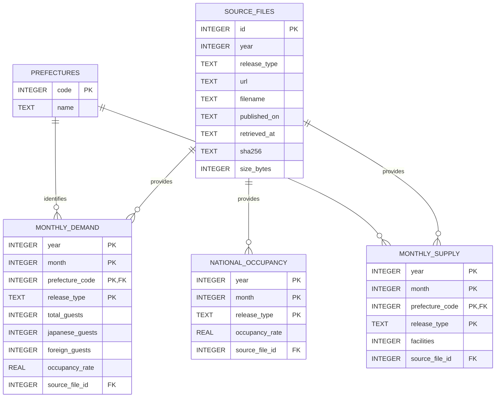

# Hotel Supply & Demand ETL

> [!IMPORTANT]
> Google Colab上の旧分析を、ホテル不動産の担保評価・与信管理を支援する宿泊市場モニタリング基盤へ再構築しています。年確定値による全国・都道府県マクロ分析と、月次第2次速報による市区町村ローカル市場分析を、同じリポジトリ内の独立したデータパイプラインとして扱います。

> [!WARNING]
> 現在の分析・parser・レポートコードはレビュー前です。指標定義、方向判定、相対評価、生成結果は暫定版であり、独立したコードレビューと分析妥当性レビューが完了するまで確定仕様として扱いません。

## このプロジェクトで解決する業務課題

ホテルの担保評価では、全国や都道府県の市場環境だけでなく、担保物件が所在する市区町村の宿泊需要・客室稼働率を継続的に確認する必要があります。特に市区町村値は、e-Statで月ごとに配布される第2次速報Excelを個別に開き、複数の参考表を横断して集計する必要があり、実務上の負担が大きい作業です。

本プロジェクトは、次の二つの粒度を分離して自動化します。

| ドメイン | 入力 | 粒度・更新頻度 | 主な用途 | 状態 |
|---|---|---|---|---|
| `prefecture` | 観光庁の年確定値Excel | 全国・47都道府県／年次 | ホテル市場の地合いと都道府県マクロ環境の把握 | 暫定レポート実装済み・レビュー前 |
| `municipality` | e-Statの第2次速報Excel | 主な市区町村／月次 | 担保所在地の需要・稼働率時系列の確認 | ETL・暫定レポート実装済み、レビュー前 |

市区町村値は全市区町村の完全な統計ではありません。公式Excelに掲載される「主な市区町村」のうち、市区町村別・客室区分別に10施設以上の回収があった区分の実数です。未回収分を推定した都道府県値とは集計基準が異なるため、市区町村値の合計から都道府県値を再構成しません。

## v2 再構築方針

観光庁「宿泊旅行統計調査」はe-Statと観光庁から公式Excelが配布され、一部の旧系列はe-Stat APIからも取得できます。継続利用には、年度別の提供形式、速報値と確定値、訂正・差し替え、欠損、データ品質を管理する必要があります。

API提供範囲を実測した結果、2019・2024・2025年の年確定値は統計値APIの対象として確認できませんでした。そのため、2019～2025年MVPは公式Excelを入力とし、属人的なNotebook処理を、公式データの取得から検証、蓄積、分析用データ生成、レポート出力まで再実行できるデータパイプラインへ移行します。

### 利用目的

担保評価・審査・与信管理の担当者が、全国から担保所在地まで段階的に市場を確認し、評価前提や個別ホテルの実績について追加確認が必要な変化を把握することを目的とします。

```text
全国のホテル市況
    ↓
都道府県の需要構造・稼働率・季節性
    ↓
担保所在地である市区町村の月次需要・客室稼働率
    ↓
個別ホテルのADR・RevPAR・GOP・競合状況を追加調査
```

本システムは担保価値、融資可否、LTV、個別ホテルの収益性を自動算定するものではありません。統計加工と比較作業を自動化し、評価担当者が追加調査すべき市場と期間を確認するための補助資料を生成します。

### 技術的な取り組み

v2では、次の機能を段階的に実装します。

- `sources.toml`に明示した公式URLからExcelを取得する処理
- URL、公表日、取得日時、SHA-256による来歴管理と、同一ファイルの再取得を避ける冪等性
- 2019～2025年の年確定値 `.xlsx` を共通スキーマへ正規化する処理
- e-Stat APIの提供範囲・統計表・分類コードを調査するAPIクライアント
- API提供状況が変わった場合の公式Excelとの標本照合
- アプリケーションIDを環境変数・CI Secretsで扱う認証情報管理
- 需要、供給、出典、公表版を分離したSQLiteデータモデル
- 速報値・確定値・訂正値を上書きせず保持する履歴管理
- 都道府県、年月、重複、欠損、数値範囲を確認するデータ品質検証
- stagingとトランザクションを用いた安全かつ冪等なDB更新
- fetch → normalize → validate → load → report を実行するCLI
- fixtureを用いたparserテスト、回帰テスト、統合テスト
- テストによる取得・変換・品質検証の自動確認
- SQL viewを介した分析用月次・年次データの提供
- 公式全国客室稼働率、インライン市場breadth、インバウンド・季節変動ランキングの生成
- 施設数を含む47都道府県一覧の検索・数値ソート
- 需要・客室稼働率の時系列と施設数KPIを示す都道府県別Market Sheetの生成
- 月次第2次速報を提供元、source ID、調査年月、公表日で固定する市区町村ソース管理
- 市区町村別の参考第5・6・8・11・12表を市区町村・客室区分単位で結合するparser
- 市区町村名の正規化、欠測・非表章管理、掲載自治体・客室区分・整合性の品質検証
- 市区町村マスター、月次ファクト、e-Stat出典を分離したSQLiteロード
- 市区町村別の需要・外国人需要・客室稼働率を確認するMarket Sheet

この再構築を通じて、外部の非構造データを取得・正規化するだけでなく、出典、版、品質、再実行性、下流利用まで考慮した小規模データパイプラインの設計・実装を目指します。

### 自動化範囲の設計判断

年確定値は更新頻度が低く、MVPの対象ファイル数も限定されます。そのため、都道府県側はレビュー可能な`sources.toml`に取得対象URLを明示します。市区町村側も初期版では公式一覧ページを実行時にスクレイピングせず、`municipality_sources.toml`へ提供元、調査年月、公表日、source ID、原ExcelのURLを固定します。いずれも取得時にXLSX形式、SHA-256、取得履歴を検証する方針です。

公式ページからのリンク自動発見、速報値の定期取得、GitHub Actionsによる巡回、自動PRは、継続運用の必要性が確認された場合のOptional機能とします。低頻度・少数ファイルのために複雑な収集基盤を先に作らず、ETL本体、品質検証、再現性を優先します。

開発工程、フェーズ、完了条件は [v2ロードマップ](plan_memo/v2-roadmap.md) を参照してください。このロードマップは開発完了後に削除する内部工程資料であり、利用者向け仕様は`docs/`へ残します。
e-Stat APIの実測結果は [e-Stat API 提供範囲調査](docs/estat-api-audit.md) に記録しています。

## 現在の状態

都道府県側は、2019～2025年の年確定値Excelについて、取得、manifest・SHA-256による来歴管理、SQLite再生成、全国ダッシュボード、47都道府県Market Sheetまで実装済みです。分析ロジックとレポートは暫定版でありレビュー前です。

市区町村側は、公式原Excelを固定する`municipality_sources.toml`、取得・manifest・SHA-256管理、月次共通レコードモデル、参考第5・6・8・11・12表を結合するparser、品質検証、SQLiteロード、専用CLI、市区町村一覧と月次Market Sheetを実装しました。都道府県側と比較期間を合わせ、2019年1月～2026年5月の連続89か月、72,688レコード、307自治体を収録しています。原則はe-Statを利用し、e-Statから原Excelリンクを確認できない2026年1月のみ観光庁公式Excelを採用します。parserは都道府県名と市区町村名を分離し、総数・1～9室・10～19室・20室以上を別レコードとして保持します。レポートと集計ロジックは暫定版でありレビュー前です。月別の掲載状況、例外ソース、公式表の値・掲載差異、2026年1月からの層化基準変更は[市区町村第2次速報 ソース収録状況](docs/municipality-source-coverage.md)に記録しています。

### 処理フローとモジュール構成

ドメインは同一リポジトリ内で分離します。既存のルート直下モジュールは稼働中の都道府県パイプラインです。市区町村parserと品質ルールが安定するまでは既存コードを一括移動せず、新機能を`municipality/`へ実装します。重複が実際に確認された取得・manifest・XLSX検証だけを、その後`common/`へ抽出します。

```text
src/hotel_supply_demand/
├── cli.py                       共通CLIエントリーポイント
├── sources.py                   都道府県・年確定値ソース（移行予定）
├── fetcher.py                   現行の都道府県Excel取得
├── parser.py                    現行の都道府県parser
├── validation.py               現行の都道府県品質検証
├── database.py                 現行の都道府県DBロード
├── analysis.py                 都道府県分析
├── report.py                   全国・都道府県レポート
└── municipality/
    ├── models.py               市区町村月次共通レコード
    ├── fetcher.py              e-Stat原Excel取得・manifest管理
    ├── parser.py               市区町村参考表の検証・結合
    ├── validation.py           市区町村月次レコードの品質検証
    ├── database.py             市区町村ファクトの冪等ロード
    ├── pipeline.py             月次処理のオーケストレーション
    └── sources.py              e-Stat月次ソース設定の読込・検証
```

最終的には`prefecture/`、`municipality/`、`common/`へ整理しますが、構造変更と市区町村分析ロジックの追加を同時に行わず、レビュー可能な単位で段階的に移行します。

#### 都道府県パイプライン（実装済み・レビュー前）

CLIがコマンドを受け付け、`pipeline.py`が都道府県ユースケース全体を調整します。`pipeline.py`自身に取得・変換・保存の詳細を集約せず、各処理を責務別のモジュールへ委譲しています。

```text
sources.toml
     │
     ▼
  cli.py                         コマンドの受付
     │
     ▼
pipeline.py                      処理順序の制御（オーケストレーション）
     ├── sources.py              公式データ取得元の設定読込・検証
     ├── fetcher.py              Excel取得・形式検証・manifest／ハッシュ管理
     ├── parser.py               年次Excelから共通月次レコードへの変換
     ├── validation.py           件数・キー・値範囲・整合性の品質検証
     └── database.py             検証済みレコードからSQLiteを安全に再生成
             │
             ▼
 data/processed/hotel_market.sqlite3
             │
             ├── analysis.py    年次指標・市場状態・ウォッチ理由の算出
             └── report.py      CSV・全体HTML・47県マーケットシートの生成
```

#### 市区町村パイプライン（ETL実装済み）

```text
municipality_sources.toml
     │  調査年月・公表日・statInfId・原Excel URLを固定
     ▼
municipality/sources.py          設定とe-Stat URLの検証
     ▼
municipality/fetcher.py          原Excel取得・manifest・SHA-256管理
     ▼
municipality/parser.py           参考第5・6・8・11・12表の結合
     ▼
municipality/validation.py       掲載自治体・客室区分・値範囲・内訳整合性の検証
     ▼
municipality/database.py         出典・マスター・月次ファクトへ冪等ロード
     ▼
municipality/report.py           市区町村一覧と担保所在地の月次Market Sheet
```

| モジュール | 責務 |
|---|---|
| `cli.py` | CLIエントリーポイント。引数を解釈し、パイプラインまたはe-Stat調査機能を呼び出す |
| `pipeline.py` | 取得、ハッシュ照合、変換、検証、DB生成を所定の順序で接続する |
| `sources.py` | `sources.toml`を読み込み、対象年、URL、ファイル名を検証する |
| `fetcher.py` | 公式Excelを一時ファイルへ取得し、XLSX形式とSHA-256を検証してRaw領域へ保存する |
| `parser.py` | 年度別Excelの第1表・第4表・第8表を都道府県月次値と公式全国客室稼働率へ正規化する |
| `validation.py` | 47都道府県、12か月、重複、負数、稼働率などの品質ルールを適用する |
| `database.py` | 需要・供給・出典をSQLiteへ格納し、成功したDBを原子的に置き換える |
| `models.py` | モジュール間で受け渡す共通月次データモデルを定義する |
| `analysis.py` | DBからLTM・直近3か月指標と全国相対順位を計算し、方向の組み合わせから市場状態と検知理由を生成する |
| `report.py` | 全国の市況・breadth・ランキングと、需要・稼働率の県別時系列、施設数KPIを生成する |
| `estat_client.py` | e-Stat APIの提供範囲とメタデータを調査する外部APIクライアント |
| `municipality/models.py` | 市区町村月次ETLで受け渡す需要・稼働率・回収施設数の共通モデルを定義する |
| `municipality/fetcher.py` | e-Stat原Excelを安全に取得し、調査年月・公表日・`statInfId`・SHA-256をmanifestへ記録する |
| `municipality/parser.py` | 5つの市区町村参考表を所在地・客室区分で結合し、非表章値をNULL相当として正規化する |
| `municipality/sources.py` | e-Stat原Excelの`statInfId`、調査年月、公表日、URL、保存名を検証する |
| `municipality/validation.py` | キー重複、4客室区分、非負数、稼働率、需要内訳、施設数内訳を検証する |
| `municipality/database.py` | e-Stat出典、市区町村マスター、月次ファクトを同一トランザクションで置換する |
| `municipality/pipeline.py` | 市区町村Excelの取得、ハッシュ照合、変換、検証、月次ロードを接続する |

この分割により、取得元、Excel形式、品質ルール、保存先のいずれかが変わった場合でも、変更範囲を該当モジュールへ限定し、それぞれを独立してテストできます。品質検証が成功するまでDBを更新しないことも、処理順序として明示しています。

### SQLite ER図

出典、都道府県マスター、需要統計、供給統計を分離し、各統計行から取得元の公式Excelを追跡できる構成です。需要・供給テーブルの主キーは、対象年、対象月、都道府県、公表区分の複合キーです。



各列の定義、単位、欠測値の扱いは[データ辞書](docs/data-dictionary.md)に記載しています。分析用Viewは永続テーブルと分けています。

市区町村側は`municipality_source_files`、`municipalities`、`monthly_municipality_market`へ分離して保存します。市区町村実数と都道府県推計値は別ファクトとして保持し、月次ファクトからsource ID、URL、公表日、取得日時、SHA-256を追跡できます。

都道府県側のDBを再生成する場合も、既存の市区町村3テーブルは新しいDBへ引き継ぎます。これにより、年次確定値の更新と月次第2次速報の更新を独立して実行しても、もう一方のデータを消さずに同じSQLiteを更新できます。

### Phase 1の実行方法

Python 3.11以上で仮想環境を作成し、`pyproject.toml`からインストールします。Excelパイプラインにe-StatのアプリケーションIDは不要です。

```bash
python -m venv .venv
.venv/bin/python -m pip install -e .
.venv/bin/hotel-etl pipeline
```

この1コマンドで公式Excel 7ファイルを取得し、`data/raw/manifest.json`へ来歴を記録して、`data/processed/hotel_market.sqlite3`と`reports/latest/`の分析レポートを生成します。同じURL・ハッシュの取得済みファイルはスキップします。ネットワークを使わず取得済みExcelからDBだけを作り直す場合は次を実行します。

```bash
.venv/bin/hotel-etl build-db
```

既存DBからレポートだけを再生成する場合：

```bash
.venv/bin/hotel-etl monitor --target-year 2025 --base-year 2019
```

主な成果物は次のとおりです。

- [`reports/latest/index.html`](reports/latest/index.html)：全国客室稼働率、市場breadth、インバウンド・季節変動ランキング、検索・ソート可能な都道府県一覧
- `reports/latest/market-sheets/`：県別Summary、需要・客室稼働率の月次時系列、施設数KPI
- `reports/latest/prefecture-market.csv`：全47県の分析結果

全国値には47都道府県の単純平均ではなく、観光庁Excel第8表の全国客室稼働率を使用します。都道府県別の平均稼働率は月次12値の単純平均です。指標定義と利用上の制約は[分析方法論](docs/methodology.md)、分析期間は[`analysis.toml`](analysis.toml)に明示しています。

特定年だけを検証する場合は、たとえば `--years 2019 2024 2025` を付けます。全テストは次で実行できます。

```bash
.venv/bin/python -m unittest discover -s tests -v
```

DBの列定義と欠測値の扱いは[データ辞書](docs/data-dictionary.md)を参照してください。

### 市区町村パイプラインの実行方法

設定済みのe-Stat第2次速報Excelを取得し、検証後に同じSQLiteへ市区町村月次ファクトをロードします。e-Stat APIのアプリケーションIDは不要です。

```bash
.venv/bin/hotel-etl municipality-pipeline
```

このコマンドは次を実行します。

1. `municipality_sources.toml`から提供元・調査年月・公表日・source IDを読み込む
2. `fileKind=0`の原Excelを`data/raw/municipality/`へ取得する
3. `manifest.json`へ取得日時・SHA-256・ファイルサイズを記録する
4. 参考第5・6・8・11・12表を市区町村・客室区分単位で結合する
5. キー、4客室区分、欠測、値範囲、需要・施設数内訳を検証する
6. `municipality_source_files`、`municipalities`、`monthly_municipality_market`へロードする
7. `reports/latest/municipalities/`へ市区町村一覧とMarket Sheetを生成する

生成物は次のとおりです。

- `reports/latest/municipalities/index.html`：都道府県絞り込み・市区町村検索が可能な一覧
- `reports/latest/municipalities/market-sheets/`：需要、外国人比率、稼働率、客室規模別内訳を示す個別ページ

DBを更新せずレポートだけ再生成する場合は次を使用します。

```bash
.venv/bin/hotel-etl municipality-report
```

取得だけ、または取得済みExcelからのDB再生成だけを行う場合は次を使用します。

```bash
.venv/bin/hotel-etl municipality-fetch --periods 2026-05
.venv/bin/hotel-etl municipality-build-db --periods 2026-05
```

同じ月を再実行した場合、URL・source ID・SHA-256が一致するExcelの再取得を省略し、SQLiteの対象月を1トランザクションで置き換えます。

特定月だけを更新する場合は、例えば`--periods 2026-05`を指定します。

### e-Stat API探索の実行方法

画像やチャットへ公開していない新しいe-StatアプリケーションIDを環境変数へ設定します。

```bash
read -s ESTAT_APP_ID
export ESTAT_APP_ID
echo
```

Codexなど別の実行セッションから利用する場合は、Git除外済みの`.env`へ保存できます。

```bash
read -s ESTAT_APP_ID
printf 'ESTAT_APP_ID=%s\n' "$ESTAT_APP_ID" > .env
unset ESTAT_APP_ID
echo
```

開発版をインストールせずに統計表を検索する場合：

```bash
PYTHONPATH=src python -m hotel_supply_demand.cli search-tables \
  --query '宿泊旅行統計調査' \
  --limit 20
```

統計表IDを特定した後は、メタ情報と少量のサンプルを取得できます。

```bash
PYTHONPATH=src python -m hotel_supply_demand.cli show-metadata \
  --stats-data-id '<統計表ID>'

PYTHONPATH=src python -m hotel_supply_demand.cli fetch-sample \
  --stats-data-id '<統計表ID>' \
  --limit 10
```

認証情報を必要としない初期テスト：

```bash
PYTHONPATH=src python -m unittest discover -s tests -v
```

現行版には次の既知の課題があります。

- Google ColabとGoogle Driveの絶対パスへの依存
- rawデータと取得手順の不足
- Excel読込などに必要な依存関係の不足
- NotebookへのETL・分析・可視化処理の集中
- 出力先とリポジトリ構成の不一致
- 保存済みCSVと現在のNotebookコードの列定義の不一致
- データ来歴、版管理、品質検証、テストの不足
