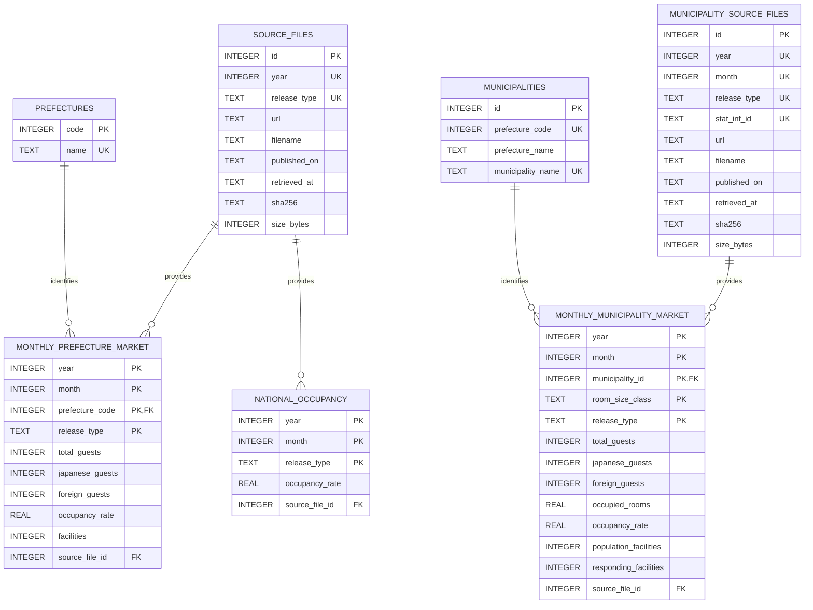

# SQLiteデータモデル

## 目的

本プロジェクトは、都道府県の年確定値と、市区町村の月次第2次速報を`data/processed/hotel_market.sqlite3`に保存する。両者は推計の有無と表章条件が異なるため、別の出典・マスター・ファクトとして保持する。市区町村値の合計から都道府県値を再構成しない。

## ER図

`UK`は単独列の一意制約とは限らず、図上で複合一意制約を構成する列も示す。`municipalities.prefecture_code`は都道府県コードを保持するが、現行DDLでは`prefectures`への外部キーを定義していない。

## キーと出典追跡

| テーブル | 主キーまたは一意キー | 出典への接続 |
|---|---|---|
| `source_files` | `id`、一意：`year + release_type` | 都道府県Excelの来歴 |
| `monthly_prefecture_market` | `year + month + prefecture_code + release_type` | `source_file_id` |
| `national_occupancy` | `year + month + release_type` | `source_file_id` |
| `municipality_source_files` | `id`、一意：`year + month + release_type`および`stat_inf_id` | 市区町村Excelの来歴 |
| `municipalities` | `id`、一意：`prefecture_code + municipality_name` | — |
| `monthly_municipality_market` | `year + month + municipality_id + room_size_class + release_type` | `source_file_id` |

## 分析用View

| View | 役割 |
|---|---|
| `latest_prefecture_market` | 年月・都道府県ごとに`final`を優先した都道府県月次ファクトを選択し、都道府県名を付与 |
| `annual_market` | `latest_prefecture_market`を年・都道府県・公表区分で年次集計 |

市区町村レポートは現時点でViewを使わず、`monthly_municipality_market`とマスター・出典テーブルを直接結合する。

## 更新方式

- 都道府県：一時SQLiteを新規生成し、既存DBから市区町村の3テーブルを引き継いだ後、`os.replace`で完成DBを原子的に置き換える。
- 市区町村：`BEGIN IMMEDIATE`後、対象年月・公表区分の既存ファクトを削除し、検証済みレコードを再挿入してコミットする。失敗時はロールバックする。

## 実装との対応

- 全体DDLと都道府県更新：`src/hotel_supply_demand/prefecture/database.py`
- 市区町村DDLと月次更新：`src/hotel_supply_demand/municipality/database.py`
- 列の意味、単位、NULLの扱い：[`data-dictionary.md`](data-dictionary.md)
